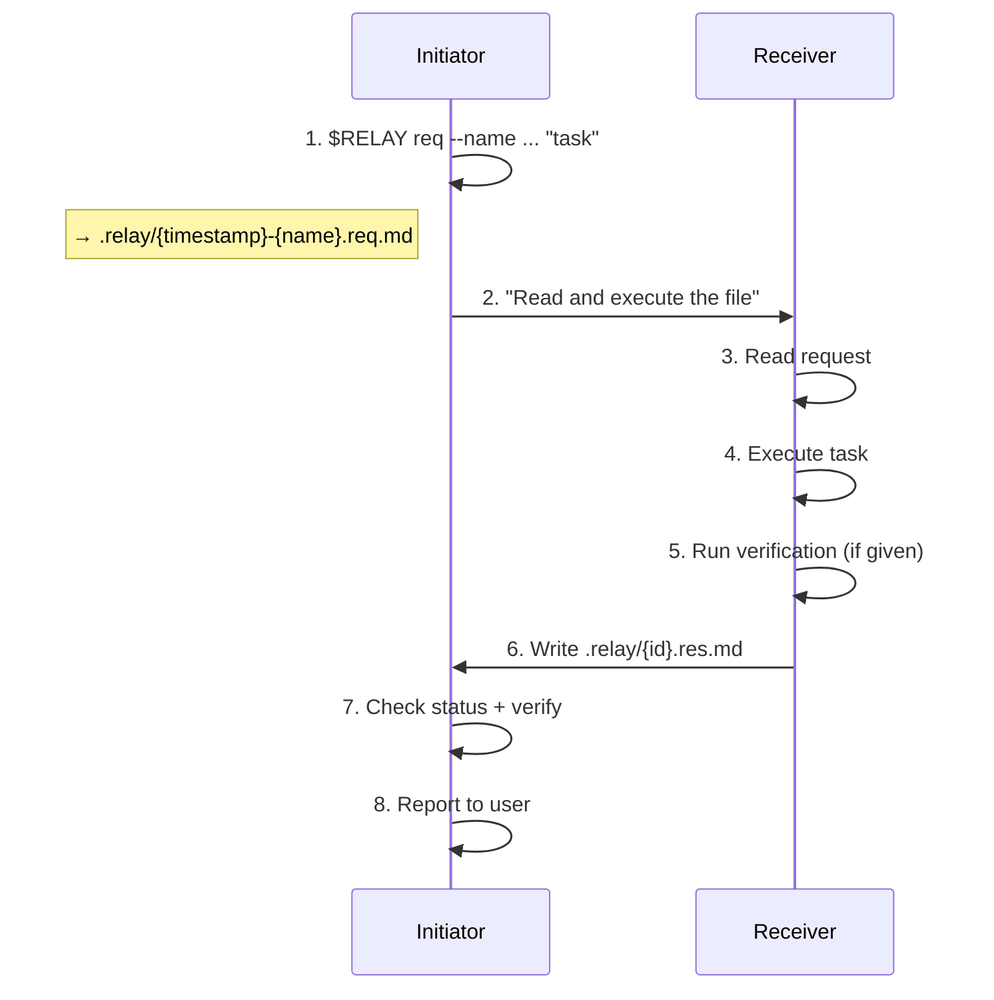

# Relay

**A skill for [Claude Code](https://docs.anthropic.com/en/docs/claude-code) and [Codex CLI](https://github.com/openai/codex) that teaches them to talk to each other.**

English | [中文](README_CN.md)

Relay lets one agent call another like a function. Write a task, invoke the peer, read the result. Minimal protocol, natural language, fully auditable.

```
relay(task, session?) → {status, verify, body}
```

Co-authored by Claude Code and Codex.

---

## Why

When you run one agent, you get one model's strengths. Relay lets you compose both:

- **Delegate tasks** from one agent to the other without copy-paste
- **Get second opinions** by having one agent review the other's work
- **Run cross-model workflows** (implement with one, verify with the other)

### Why not subagents?

Subagents spawn copies of the same model. Relay calls a different model — different training, different reasoning, different blind spots. A cross-model review catches more.

---

## Philosophy

Relay combines practical agent design lessons from Anthropic and OpenAI into a minimal protocol.

- **Protocol fades, task shines.** Frontmatter routes messages; the task stays in natural language. [^1]
- **Self-contained, reference-first.** A request includes the task and response template, while context stays as file references instead of pasted blobs. [^2]
- **Verification is first-class.** Responses carry `verify: pass | fail | skip` in frontmatter. Commands and evidence stay in the body. [^3]
- **Guided, not enforced.** Relay recommends a body pattern but avoids rigid schema. [^4]

These choices reduce formatting failures, keep protocol rules in one place (the request file), and let callers branch on verification without parsing prose.

---

## Made by Agents, for Agents

Relay was built by Claude Code and Codex through Relay itself: each agent researched its ecosystem, debated trade-offs across relay turns, reviewed the other's changes, and verified the result end-to-end.

The skill is meant to be edited. `SKILL.md` is plain markdown, so teams can adapt it quickly:

- Change the body pattern to match your workflow
- Add domain-specific verification commands
- Adjust the response footer template
- Swap peer names for other agent pairs

Relay stays intentionally small: no locked schema, just a readable protocol that agents and humans can extend.

---

## How It Works



---

## Installation

Each skill bundles its own `scripts/relay` generator — no shared binary needed.

**Claude Code skill:**

```bash
mkdir -p ~/.claude/skills/relay/scripts
curl -sL https://raw.githubusercontent.com/chrisliu298/relay/main/claude/skills/relay/SKILL.md \
  -o ~/.claude/skills/relay/SKILL.md
curl -sL https://raw.githubusercontent.com/chrisliu298/relay/main/claude/skills/relay/scripts/relay \
  -o ~/.claude/skills/relay/scripts/relay && chmod +x ~/.claude/skills/relay/scripts/relay
```

**Codex CLI skill:**

```bash
mkdir -p ~/.codex/skills/relay/scripts
curl -sL https://raw.githubusercontent.com/chrisliu298/relay/main/codex/skills/relay/SKILL.md \
  -o ~/.codex/skills/relay/SKILL.md
curl -sL https://raw.githubusercontent.com/chrisliu298/relay/main/codex/skills/relay/scripts/relay \
  -o ~/.codex/skills/relay/scripts/relay && chmod +x ~/.codex/skills/relay/scripts/relay
```

**Important:** Install and update both skills together, and keep them on the same Relay version. Request/response formats must match; version skew can cause parse failures on either side.

---

## Usage

Tell your agent to delegate work:

> "Ask Codex to review the auth middleware in src/auth.py"

> "Send this to Claude for a second opinion on the caching strategy"

Or invoke directly with `/relay`.

---

## The Interface

### One-Shot Call

The `scripts/relay` script generates a self-contained request with frontmatter, body, and response template. The `--name` flag provides a human-readable slug; the script prepends a timestamp automatically.

**Claude Code → Codex:**

```bash
REQ=$(~/.claude/skills/relay/scripts/relay req --from claude --to codex --name auth-review "Review src/auth.py for security issues. Run pytest to verify.") && codex exec --full-auto "Read and execute $REQ"
```

**Codex → Claude Code:**

```bash
REQ=$(~/.codex/skills/relay/scripts/relay req --from codex --to claude --name auth-review "Review src/auth.py for security issues. Run pytest to verify.") && env -u CLAUDECODE claude -p --dangerously-skip-permissions "Read and execute $REQ"
```

- `env -u CLAUDECODE` prevents nested-session errors
- `--dangerously-skip-permissions` is required for non-interactive mode

Generated request `.relay/20260219-1630-auth-review.req.md`:

```markdown
---
relay: 4
id: 20260219-1630-auth-review
from: claude
to: codex
---

Review src/auth.py for security issues. Run pytest to verify.

---
Reply: .relay/20260219-1630-auth-review.res.md
Format:
  ---
  relay: 4
  re: 20260219-1630-auth-review
  from: codex
  to: claude
  status: done | error
  verify: pass | fail | skip
  ---
  {your response}
```

### Session Call

Sessions keep full turn history so the receiver reads all prior exchanges for context:

```text
.relay/
  auth-refactor/         # session directory
    01.req.md            # turn 1 request
    01.res.md            # turn 1 response
    02.req.md            # turn 2 request (can be terse — context is in prior turns)
    02.res.md            # turn 2 response
```

**Claude Code → Codex:**

```bash
REQ=$(~/.claude/skills/relay/scripts/relay req --from claude --to codex --session auth-refactor "Fix the issues and add tests. Run pytest to verify.") && codex exec --full-auto "Read and execute $REQ"
```

**Codex → Claude Code:**

```bash
REQ=$(~/.codex/skills/relay/scripts/relay req --from codex --to claude --session auth-refactor "Fix the issues and add tests. Run pytest to verify.") && env -u CLAUDECODE claude -p --dangerously-skip-permissions "Read and execute $REQ"
```

Session names must be slugs (`[a-z0-9-]+`). Sessions are sequential — one writer at a time.

### Output

The response file (one-shot or session):

```markdown
---
relay: 4
re: 20260219-1630-auth-review
from: codex
to: claude
status: done
verify: pass
---

Found 2 issues in src/auth.py:
1. Session token not validated on line 45 — added hmac check
2. Missing input sanitization on line 52 — added parameterized query

All 12 tests pass after changes.
```

- **status**: `done` | `error`
- **verify**: `pass` | `fail` | `skip`
- **body**: findings, changes, reasoning — free-form markdown

If the response file is missing after invocation, the peer failed or timed out.

---

## Safety

- `.relay/` is gitignored — the script handles this automatically
- **Codex** uses `--full-auto` (`workspace-write` sandbox)
- **Claude** uses `--dangerously-skip-permissions` in non-interactive mode — use only in trusted repos
- Clean up: `rm .relay/*.md` (one-shot) or `rm -rf .relay/{session}/` (session)

---

## Repo Structure

```text
relay/
├── claude/skills/relay/
│   ├── SKILL.md
│   └── scripts/relay     # request/response generator
└── codex/skills/relay/
    ├── SKILL.md
    └── scripts/relay     # identical copy
```

---

## Contributors

- [@chrisliu298](https://github.com/chrisliu298)
- **Claude Code** — protocol design
- **Codex** — execution contract and CLI integration

[^1]: Anthropic — [Building effective agents](https://www.anthropic.com/research/building-effective-agents), [Writing tools for agents](https://www.anthropic.com/engineering/writing-tools-for-agents); OpenAI — [A practical guide to building agents](https://openai.com/business/guides-and-resources/a-practical-guide-to-building-ai-agents/), [Unrolling the Codex agent loop](https://openai.com/index/unrolling-the-codex-agent-loop/)
[^2]: Anthropic — [Effective context engineering](https://www.anthropic.com/engineering/effective-context-engineering-for-ai-agents); OpenAI — [Conversation state](https://developers.openai.com/api/docs/guides/conversation-state), [Compaction](https://developers.openai.com/api/docs/guides/compaction)
[^3]: Anthropic — [Demystifying evals for AI agents](https://www.anthropic.com/engineering/demystifying-evals-for-ai-agents); OpenAI — [Agent evals](https://developers.openai.com/api/docs/guides/agent-evals)
[^4]: Anthropic — [Building effective agents](https://www.anthropic.com/research/building-effective-agents), [Writing tools for agents](https://www.anthropic.com/engineering/writing-tools-for-agents); OpenAI — [Function calling](https://developers.openai.com/api/docs/guides/function-calling)
