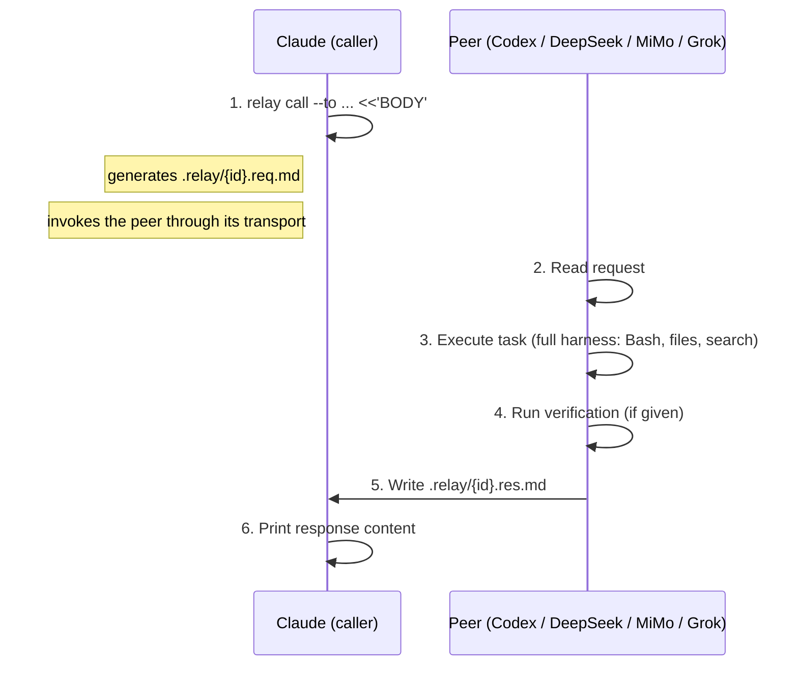

# Relay

**A skill that lets [Claude Code](https://docs.anthropic.com/en/docs/claude-code) call other frontier models — Codex, DeepSeek, MiMo, and Grok — like a function.**

> *A baton changes hands, the race continues. One agent writes the task, another picks it up and runs.*

Relay turns a cross-model call into a single command: write a task, invoke a peer, read the result. Minimal protocol, natural language, fully auditable. Each peer runs as a **full agent in the Claude Code harness** — not a stateless API call — so it has Bash, file read/write, search, and multi-step agentic loops, and can see and verify its own work in your repo.

```bash
relay call --name <slug> [--to <peer>] [--effort <level>] [--body-only] <<'BODY'
task
BODY
```

The caller is always Claude; the peer defaults to **Codex**. Route elsewhere with `--to deepseek`, `--to mimo`, `--to grok-build`, or `--to grok-composer`.

## Table of Contents

- [Why](#why)
- [Philosophy](#philosophy)
- [How It Works](#how-it-works)
- [Installation](#installation)
- [Peers](#peers)
- [Usage](#usage)
- [Effort Levels](#effort-levels)
- [Output](#output)
- [The Peer Registry](#the-peer-registry)
- [Async / Parallel](#async--parallel)
- [Prism Integration](#prism-integration)
- [Safety](#safety)
- [Repo Structure](#repo-structure)
- [Contributors](#contributors)

---

## Why

When you run one agent, you get one model's strengths. Relay lets you compose many:

- **Delegate tasks** to a peer without copy-paste
- **Get second opinions** by having a different-lineage model review the work
- **Run cross-model workflows** (implement with one, verify with another)
- **Power multi-agent deliberation** — Relay is the transport for [Prism](https://github.com/chrisliu298/prism)'s Parallax tier

### Why not subagents?

Subagents spawn copies of the same model. Relay calls a **different** model — different training, different reasoning, different blind spots. A cross-model review catches more. Subagents can also invoke Relay (`/relay`), combining same-model parallelism with cross-model depth.

---

## Philosophy

Relay is a minimal protocol distilled from agent-design lessons across vendors.

- **Protocol fades, task shines.** Frontmatter routes the message; the task stays in natural language. [^1]
- **Self-contained, reference-first.** A request carries the task and a response template, while context stays as file references instead of pasted blobs. [^2]
- **Verification is first-class.** Responses carry `verify: pass | fail | skip` in frontmatter; commands and evidence stay in the body. [^3]
- **Guided, not enforced.** Relay recommends a body pattern but avoids a rigid schema. [^4]

These choices reduce formatting failures, keep protocol rules in one place (the request file), and let the caller branch on verification without parsing prose.

---

## How It Works


```mermaid
sequenceDiagram
    participant C as Claude (caller)
    participant P as Peer (Codex / DeepSeek / MiMo / Grok)

    C->>C: 1. relay call --to ... <<'BODY'
    Note left of C: generates .relay/{id}.req.md
    Note left of C: invokes the peer through its transport
    P->>P: 2. Read request
    P->>P: 3. Execute task (full harness: Bash, files, search)
    P->>P: 4. Run verification (if given)
    P->>C: 5. Write .relay/{id}.res.md
    C->>C: 6. Print response content
```

The `call` subcommand wraps the full round-trip: it generates the request file, invokes the peer through that peer's registered transport, and prints the response to stdout.

---

## Installation

Clone the repo, symlink the skill into Claude Code, and put `relay` on your PATH.

```bash
git clone https://github.com/chrisliu298/relay.git ~/.cache/relay-src

# Claude Code skill
ln -s ~/.cache/relay-src ~/.claude/skills/relay

# Make `relay` callable directly (recommended)
mkdir -p ~/.local/bin
ln -s ~/.cache/relay-src/scripts/relay ~/.local/bin/relay
```

Ensure `~/.local/bin` is on your PATH. The peer model and invocation method come from [`peers.json`](peers.json) next to the script — never pass `-m`/`--model`.

**Prerequisites per peer:** Codex needs the `codex` CLI; Grok needs the `grok` CLI (cached login, no key); DeepSeek needs `DEEPSEEK_API_KEY`; MiMo needs `MIMO_API_KEY`. Peers you don't configure simply aren't reachable — the rest still work.

---

## Peers

| Peer | Lineage | When to pick | Effort |
|---|---|---|---|
| **Codex** (default) | GPT-5.5 | Code review, security review, refactoring, agentic coding | `medium` / `xhigh` |
| **DeepSeek** | DeepSeek V4-Pro (open-weight) | Independent cross-vendor diversity, frontier reasoning, multi-step analysis. Always runs at `max` (DeepThink). Text-only. | — |
| **MiMo** | Xiaomi MiMo-V2.5-Pro (open-weight) | A third independent lineage for cross-vendor perspective. Text-only. | — |
| **Grok Build** | xAI `grok-build` | xAI's agentic coding model — a fourth independent lineage | `medium` / `high` |
| **Grok Composer** | xAI `grok-composer-2.5-fast` | Faster, lighter xAI variant (same lineage as Grok Build) | — |

Pick Codex by default. Reach for DeepSeek, MiMo, or Grok Build when you want a perspective trained outside the Anthropic and OpenAI lineages — true cross-vendor diversity, the core use case for [Prism](https://github.com/chrisliu298/prism) Parallax. Treat the two Grok tiers as one vendor slot.

---

## Usage

Tell your agent to delegate:

> "Ask Codex to review the auth middleware in src/auth.py"

> "Get a second opinion from DeepSeek on the caching strategy"

Or invoke directly with `/relay` — also available to subagents.

```bash
relay call --name auth-review --effort medium <<'BODY'
Review src/auth.py for security issues. Run pytest to verify.
BODY
```

The `--name` flag is a human-readable slug; the script prepends a timestamp and PID automatically (`YYYYMMDD-HHMMSS-PID-{name}`). Every call requires `--name`.

The generated request `.relay/20260219-163042-12345-auth-review.req.md`:

```markdown
---
relay: 5
id: 20260219-163042-12345-auth-review
from: claude
to: codex
effort: medium
---

Review src/auth.py for security issues. Run pytest to verify.

---
Reply: .relay/20260219-163042-12345-auth-review.res.md
Format:
  ---
  relay: 5
  re: 20260219-163042-12345-auth-review
  from: codex
  to: claude
  status: done | error
  verify: pass | fail | skip
  ---
  {your response}
```

---

## Effort Levels

`--effort` applies to **Codex** (`medium` / `xhigh`) and **Grok Build** (`medium` / `high`, default `medium`). DeepSeek always runs at `max` (DeepThink); MiMo and Grok Composer have no effort knob, so the flag is ignored on those calls.

| Level | When to use |
|-------|-------------|
| `medium` | **Default for Codex and Grok Build.** Code review, tests, bug fixes, most refactoring. |
| `xhigh` | Codex only. Hard architecture, deep security review, eval-bound tasks worth the latency. |
| `high` | Grok Build only — its deeper reasoning tier. |

Before raising effort, improve the prompt: add outcome-first success criteria, stop rules, verification steps, and completeness criteria.

---

## Output

The `call` subcommand prints the response file to stdout. The response has YAML frontmatter followed by free-form markdown:

```markdown
---
relay: 5
re: 20260219-163042-12345-auth-review
from: codex
to: claude
status: done
verify: pass
---

Found 2 issues in src/auth.py:
1. Session token not validated on line 45 — added hmac check
2. Missing input sanitization on line 52 — added parameterized query

All 12 tests pass after changes.
```

- **status**: `done` | `error`
- **verify**: `pass` | `fail` | `skip`
- **body**: findings, changes, reasoning — free-form markdown

Use `--body-only` to strip the frontmatter and get just the body. Request and response files are saved in `.relay/` (auto-gitignored). Peer stderr is logged to a `.log` sidecar — **don't read it** (it's full stderr, very long); inspect only the `.res.md` response.

---

## The Peer Registry

Every model-family fact — transport, endpoint, key variable, model id, effort knob, per-peer extras, and launcher template style — lives once in [`peers.json`](peers.json) next to the script. Both `relay` and Prism's launcher read it, so **adding a peer that reuses an existing transport is one stanza**, not edits scattered across the script and docs.

Three transports exist today:

- **`codex`** — Codex via `codex exec`
- **`claude-env`** — an Anthropic-compatible envelope (the Claude Code harness with the model weights swapped), shared by DeepSeek and MiMo and parameterized entirely by registry data
- **`grok`** — Grok via its own headless `grok` CLI

A brand-new transport needs its own script branch; a new `claude-env` peer is one registry stanza plus a one-line entry in the inbound safety guard.

---

## Async / Parallel

By default `relay call` blocks until the peer finishes. When you have independent work alongside a call, run them concurrently — never serialize.

Use `run_in_background: true` on the Bash tool so the relay call runs while your subagents work. A completion notification arrives when it finishes — **don't poll** or inspect `.relay` files before then.

**Give it a generous timeout.** Peers are full agents and can run long (Codex `xhigh`, DeepSeek/MiMo DeepThink, Grok at `high`). A timeout that fires mid-run kills the peer and wastes every token it spent — favor completion. `timeout: 3600000` (60 min) is a reasonable outer bound; relay has no internal per-call cap.

**Never wrap relay in a subagent.** When the subagent completes, the platform kills its child processes — including the still-running peer CLI. Call `relay` directly from the main conversation with `run_in_background: true`.

---

## Prism Integration

[Prism](https://github.com/chrisliu298/prism) sends the same question to multiple independent agents, each answering from a different analytical lens. Relay powers Prism's **Parallax** tier — the cross-model agents that provide vendor diversity. The Parallax agent receives the **same full question and context** as every local reviewer; only the lens differs.

```bash
# Install both for the full Prism experience
git clone https://github.com/chrisliu298/prism.git ~/.claude/skills/prism
git clone https://github.com/chrisliu298/relay.git ~/.cache/relay-src
ln -s ~/.cache/relay-src ~/.claude/skills/relay
```

Prism reads `peers.json` from the relay skill directory next to it, so install relay as a sibling skill.

---

## Safety

- `.relay/` is gitignored — the script handles this automatically.
- **Claude-only.** If `ANTHROPIC_BASE_URL` points at a non-Anthropic endpoint (e.g. a DeepSeek/MiMo session), the skill refuses — a non-Claude session can't orchestrate other models. The script enforces this at the shell layer before the registry loads.
- **Codex** runs `--full-auto` (`workspace-write` sandbox) and `--skip-git-repo-check`.
- A dispatched peer can't recurse into Relay (the `RELAY_PEER` guard blocks it).
- Clean up: `rm -rf .relay`.

---

## Repo Structure

```text
relay/
├── SKILL.md       # the Claude Code skill (triggers, peer selection, prompting)
├── peers.json     # peer registry — single source of truth for every model fact
└── scripts/relay  # the bash script: one command, full round-trip
```

The script is the single source of truth; `SKILL.md` teaches the agent when and how to call it, and `peers.json` is the only place model facts live.

---

## Contributors

- [@chrisliu298](https://github.com/chrisliu298)
- Built and refined cross-model — each peer reviewed and verified the protocol through Relay itself.

[^1]: Anthropic — [Building effective agents](https://www.anthropic.com/research/building-effective-agents), [Writing tools for agents](https://www.anthropic.com/engineering/writing-tools-for-agents); OpenAI — [A practical guide to building agents](https://openai.com/business/guides-and-resources/a-practical-guide-to-building-ai-agents/), [Unrolling the Codex agent loop](https://openai.com/index/unrolling-the-codex-agent-loop/)
[^2]: Anthropic — [Effective context engineering](https://www.anthropic.com/engineering/effective-context-engineering-for-ai-agents); OpenAI — [Conversation state](https://developers.openai.com/api/docs/guides/conversation-state), [Compaction](https://developers.openai.com/api/docs/guides/compaction)
[^3]: Anthropic — [Demystifying evals for AI agents](https://www.anthropic.com/engineering/demystifying-evals-for-ai-agents); OpenAI — [Agent evals](https://developers.openai.com/api/docs/guides/agent-evals)
[^4]: Anthropic — [Building effective agents](https://www.anthropic.com/research/building-effective-agents), [Writing tools for agents](https://www.anthropic.com/engineering/writing-tools-for-agents); OpenAI — [Function calling](https://developers.openai.com/api/docs/guides/function-calling)
