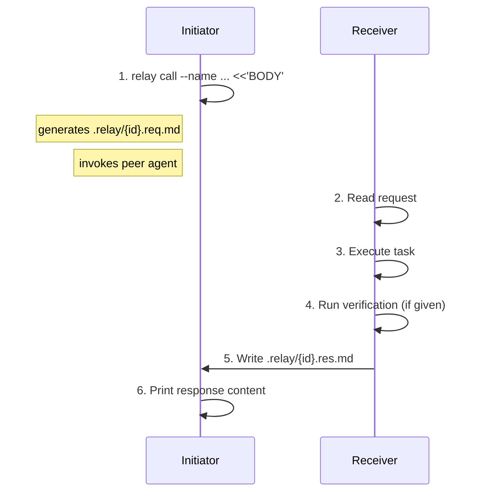

# Relay

**A skill for [Claude Code](https://docs.anthropic.com/en/docs/claude-code) and [Codex CLI](https://github.com/openai/codex) that teaches them to talk to each other.**

English | [中文](README_CN.md)

Relay lets one agent call another like a function. Write a task, invoke the peer, read the result. Minimal protocol, natural language, fully auditable.

```bash
relay call --name <slug> [--effort <level>] [--bg] [--timeout <sec>] [--body-only] <<'BODY'
task
BODY
```

Co-authored by Claude Code and Codex.

## Table of Contents

- [Why](#why)
- [Philosophy](#philosophy)
- [Made by Agents, for Agents](#made-by-agents-for-agents)
- [How It Works](#how-it-works)
- [Installation](#installation)
- [Usage](#usage)
- [The Interface](#the-interface)
- [Async / Parallel](#async--parallel)
- [Timeout](#timeout)
- [Utility Commands](#utility-commands)
- [Safety](#safety)
- [Repo Structure](#repo-structure)
- [Contributors](#contributors)

---

## Why

When you run one agent, you get one model's strengths. Relay lets you compose both:

- **Delegate tasks** from one agent to the other without copy-paste
- **Get second opinions** by having one agent review the other's work
- **Run cross-model workflows** (implement with one, verify with the other)

### Why not subagents?

Subagents spawn copies of the same model. Relay calls a different model — different training, different reasoning, different blind spots. A cross-model review catches more.

---

## Philosophy

Relay combines practical agent design lessons from Anthropic and OpenAI into a minimal protocol.

- **Protocol fades, task shines.** Frontmatter routes messages; the task stays in natural language. [^1]
- **Self-contained, reference-first.** A request includes the task and response template, while context stays as file references instead of pasted blobs. [^2]
- **Verification is first-class.** Responses carry `verify: pass | fail | skip` in frontmatter. Commands and evidence stay in the body. [^3]
- **Guided, not enforced.** Relay recommends a body pattern but avoids rigid schema. [^4]

These choices reduce formatting failures, keep protocol rules in one place (the request file), and let callers branch on verification without parsing prose.

---

## Made by Agents, for Agents

Relay was built by Claude Code and Codex through Relay itself: each agent researched its ecosystem, debated trade-offs across relay turns, reviewed the other's changes, and verified the result end-to-end.

The skill is meant to be edited. `SKILL.md` is plain markdown, so teams can adapt it quickly:

- Change the body pattern to match your workflow
- Add domain-specific verification commands
- Adjust the response footer template
- Swap peer names for other agent pairs

Relay stays intentionally small: no locked schema, just a readable protocol that agents and humans can extend.

---

## How It Works


```mermaid
sequenceDiagram
    participant I as Initiator
    participant R as Receiver

    I->>I: 1. relay call --name ... <<'BODY'
    Note left of I: generates .relay/{id}.req.md
    Note left of I: invokes peer agent
    R->>R: 2. Read request
    R->>R: 3. Execute task
    R->>R: 4. Run verification (if given)
    R->>I: 5. Write .relay/{id}.res.md
    I->>I: 6. Print response content
```

The `call` subcommand wraps the full round-trip: generates the request file, invokes the peer agent, and prints the response content to stdout. The script auto-detects caller and peer from its install path.

---

## Installation

### Quick install (npx)

```bash
npx skills add chrisliu298/relay
```

This installs the skill for all supported agents (Claude Code, Codex) using the [skills CLI](https://github.com/vercel-labs/skills).

### Manual install (curl)

Each skill bundles its own `scripts/relay` generator — no shared binary needed.

**Claude Code skill:**

```bash
mkdir -p ~/.claude/skills/relay/scripts ~/.claude/skills/relay/references
curl -sL https://raw.githubusercontent.com/chrisliu298/relay/main/claude/skills/relay/SKILL.md \
  -o ~/.claude/skills/relay/SKILL.md
curl -sL https://raw.githubusercontent.com/chrisliu298/relay/main/scripts/relay \
  -o ~/.claude/skills/relay/scripts/relay && chmod +x ~/.claude/skills/relay/scripts/relay
curl -sL https://raw.githubusercontent.com/chrisliu298/relay/main/claude/skills/relay/references/prompting-codex.md \
  -o ~/.claude/skills/relay/references/prompting-codex.md
```

**Codex CLI skill:**

```bash
mkdir -p ~/.codex/skills/relay/scripts ~/.codex/skills/relay/references
curl -sL https://raw.githubusercontent.com/chrisliu298/relay/main/codex/skills/relay/SKILL.md \
  -o ~/.codex/skills/relay/SKILL.md
curl -sL https://raw.githubusercontent.com/chrisliu298/relay/main/scripts/relay \
  -o ~/.codex/skills/relay/scripts/relay && chmod +x ~/.codex/skills/relay/scripts/relay
curl -sL https://raw.githubusercontent.com/chrisliu298/relay/main/codex/skills/relay/references/prompting-claude.md \
  -o ~/.codex/skills/relay/references/prompting-claude.md
```

**Important:** Install and update both skills together, and keep them on the same Relay version. Request/response formats must match; version skew can cause parse failures on either side.

---

## Usage

Tell your agent to delegate work:

> "Ask Codex to review the auth middleware in src/auth.py"

> "Send this to Claude for a second opinion on the caching strategy"

Or invoke directly with `/relay`.

---

## The Interface

### Models

Each direction pins a specific model. Do **not** substitute other models — they may not be available and the call will fail.

| Direction | Model flag | Reasoning effort | Notes |
|---|---|---|---|
| Claude Code → Codex | `--model gpt-5.4` | Dynamic (`none`–`xhigh`) | Claude selects effort per task |
| Codex → Claude Code | `--model opus` | N/A | No effort parameter in Claude CLI |

### One-Shot Call

One command does the full round-trip: generates the request, invokes the peer, prints the response.

**Claude Code → Codex:**

```bash
~/.claude/skills/relay/scripts/relay call --name auth-review --effort medium <<'BODY'
Review src/auth.py for security issues. Run pytest to verify.
BODY
```

**Codex → Claude Code:**

```bash
~/.codex/skills/relay/scripts/relay call --name auth-review <<'BODY'
Review src/auth.py for security issues. Run pytest to verify.
BODY
```

The `--name` flag provides a human-readable slug; the script prepends a timestamp and PID automatically (format: `YYYYMMDD-HHMMSS-PID-{name}`). The `--effort` flag controls Codex's reasoning effort (defaults to `medium`, ignored when calling Claude).

Generated request `.relay/20260219-163042-12345-auth-review.req.md`:

```markdown
---
relay: 4
id: 20260219-163042-12345-auth-review
from: claude
to: codex
effort: medium
---

Review src/auth.py for security issues. Run pytest to verify.

---
Reply: .relay/20260219-163042-12345-auth-review.res.md
Format:
  ---
  relay: 4
  re: 20260219-163042-12345-auth-review
  from: codex
  to: claude
  status: done | error
  verify: pass | fail | skip
  ---
  {your response}
```

### Session Call

Sessions keep full turn history so the receiver reads all prior exchanges for context:

```text
.relay/
  auth-refactor/         # session directory
    01.req.md            # turn 1 request
    01.res.md            # turn 1 response
    02.req.md            # turn 2 request (can be terse — context is in prior turns)
    02.res.md            # turn 2 response
```

**Claude Code → Codex:**

```bash
~/.claude/skills/relay/scripts/relay call --session auth-refactor --effort medium <<'BODY'
Fix the issues and add tests. Run pytest to verify.
BODY
```

**Codex → Claude Code:**

```bash
~/.codex/skills/relay/scripts/relay call --session auth-refactor <<'BODY'
Fix the issues and add tests. Run pytest to verify.
BODY
```

Session names must be slugs (`[a-z0-9-]+`). Sessions are sequential — one writer at a time.

### Output

The `call` subcommand prints the response file content to stdout. The response file (one-shot or session):

```markdown
---
relay: 4
re: 20260219-163042-12345-auth-review
from: codex
to: claude
status: done
verify: pass
---

Found 2 issues in src/auth.py:
1. Session token not validated on line 45 — added hmac check
2. Missing input sanitization on line 52 — added parameterized query

All 12 tests pass after changes.
```

- **status**: `done` | `error`
- **verify**: `pass` | `fail` | `skip`
- **body**: findings, changes, reasoning — free-form markdown

Use `--body-only` to strip the frontmatter and get just the markdown body.

Request and response files are saved in `.relay/` (auto-gitignored). Peer stderr is logged to a `.log` sidecar file alongside the request.

If the response file is missing after invocation, the peer failed or timed out. Inspect the request, response path, and `.log` sidecar before retrying.

### Low-Level Commands

For custom workflows or manual orchestration, use `req` and `res` directly. Body can be passed as an argument or piped via stdin.

```bash
# Generate request only
REQ=$(~/.claude/skills/relay/scripts/relay req --from claude --to codex --name slug "task body")

# Then invoke the peer manually
codex exec --model gpt-5.4 -c 'model_reasoning_effort="medium"' --full-auto "Read and execute $REQ"

# Response path
echo "${REQ%.req.md}.res.md"
```

---

## Async / Parallel

By default, `relay call` blocks until the peer finishes. When you have independent work to do alongside a relay call, use platform-native concurrency instead of serializing.

### Claude Code

Claude Code supports `run_in_background: true` on Bash tool calls and the `--bg` script flag:

```bash
# Option 1: run_in_background on the Bash tool (agent-native)
# The relay call runs in the background while subagents do other work

# Option 2: --bg flag (script-native)
# Forks the peer invocation and returns the response path immediately
RES=$(~/.claude/skills/relay/scripts/relay call --bg --name auth-review --effort medium <<'BODY'
Review src/auth.py for security issues.
BODY
)
# RES is the expected response file path — poll with: [ -f "$RES" ] && cat "$RES"
```

### Codex

Codex supports concurrency via native parallel tool calls and subagents, but **not** via shell backgrounding (`&`/`disown`/`nohup` — child processes do not survive after the shell command returns in Codex's sandbox).

**Do not use `--bg` from Codex.** Instead, spawn a Codex subagent to run the blocking relay call while the main agent continues local work:

1. Start independent local work in parallel tool calls.
2. Spawn a subagent whose only job is to run the relay call.
3. Continue local work in the main agent.
4. Wait for the relay subagent only when you need the answer.

---

## Timeout

For long-running tasks, use `--timeout <seconds>` to limit the peer invocation (requires coreutils `timeout` or `gtimeout`):

```bash
~/.claude/skills/relay/scripts/relay call --name long-task --timeout 300 --effort high <<'BODY'
Run the full test suite and generate coverage report.
BODY
```

---

## Utility Commands

```bash
# List all relay files
~/.claude/skills/relay/scripts/relay list

# List files for a specific session
~/.claude/skills/relay/scripts/relay list --session auth-refactor

# Show usage and version
~/.claude/skills/relay/scripts/relay --help
~/.claude/skills/relay/scripts/relay --version
```

---

## Safety

- `.relay/` is gitignored — the script handles this automatically
- **Codex** uses `--full-auto` (`workspace-write` sandbox)
- **Claude** uses `--dangerously-skip-permissions` in non-interactive mode — use only in trusted repos
- Clean up: `rm .relay/*.md` (one-shot) or `rm -rf .relay/{session}/` (session)

---

## Repo Structure

```text
relay/
├── scripts/relay                # canonical script (single source of truth)
├── claude/skills/relay/
│   ├── SKILL.md                 # Claude-specific skill (calls Codex)
│   ├── references/
│   │   └── prompting-codex.md   # how to prompt Codex effectively
│   └── scripts/relay            # → ../../../../scripts/relay (symlink)
└── codex/skills/relay/
    ├── SKILL.md                 # Codex-specific skill (calls Claude)
    ├── references/
    │   └── prompting-claude.md  # how to prompt Claude effectively
    └── scripts/relay            # → ../../../../scripts/relay (symlink)
```

The bash script lives once at `scripts/relay`. Both platform directories symlink to it, eliminating duplication while keeping separate SKILL.md files for each agent's distinct trigger text, async patterns, and prompting guidance.

---

## Contributors

- [@chrisliu298](https://github.com/chrisliu298)
- **Claude Code** — protocol design
- **Codex** — execution contract and CLI integration

[^1]: Anthropic — [Building effective agents](https://www.anthropic.com/research/building-effective-agents), [Writing tools for agents](https://www.anthropic.com/engineering/writing-tools-for-agents); OpenAI — [A practical guide to building agents](https://openai.com/business/guides-and-resources/a-practical-guide-to-building-ai-agents/), [Unrolling the Codex agent loop](https://openai.com/index/unrolling-the-codex-agent-loop/)
[^2]: Anthropic — [Effective context engineering](https://www.anthropic.com/engineering/effective-context-engineering-for-ai-agents); OpenAI — [Conversation state](https://developers.openai.com/api/docs/guides/conversation-state), [Compaction](https://developers.openai.com/api/docs/guides/compaction)
[^3]: Anthropic — [Demystifying evals for AI agents](https://www.anthropic.com/engineering/demystifying-evals-for-ai-agents); OpenAI — [Agent evals](https://developers.openai.com/api/docs/guides/agent-evals)
[^4]: Anthropic — [Building effective agents](https://www.anthropic.com/research/building-effective-agents), [Writing tools for agents](https://www.anthropic.com/engineering/writing-tools-for-agents); OpenAI — [Function calling](https://developers.openai.com/api/docs/guides/function-calling)
