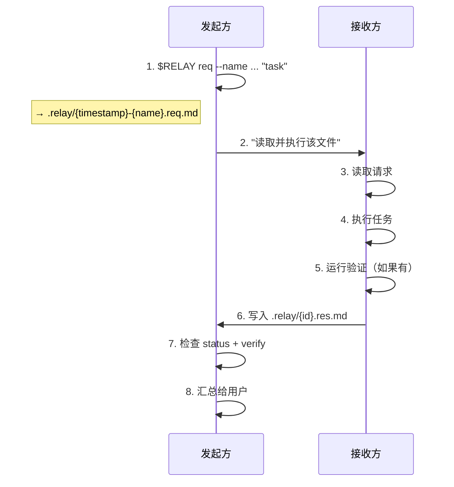

# Relay

**一个让 [Claude Code](https://docs.anthropic.com/en/docs/claude-code) 和 [Codex CLI](https://github.com/openai/codex) 进行跨模型协作的 skill。**

[English](README.md) | 中文

Relay 让一个 agent 像调用函数一样调用另一个 agent。写任务、调用对端、读结果。极简协议、自然语言通信、完全可审计。

```
relay(task, session?) → {status, verify, body}
```

由 Claude Code 和 Codex 共同开发。

## 目录

- [为什么要用 Relay](#为什么要用-relay)
- [设计哲学](#设计哲学)
- [由 Agent 打造，也为 Agent 打造](#由-agent-打造也为-agent-打造)
- [工作流程](#工作流程)
- [安装](#安装)
- [使用方式](#使用方式)
- [接口](#接口)
- [安全](#安全)
- [仓库结构](#仓库结构)
- [贡献者](#贡献者)

---

## 为什么要用 Relay

使用单一 agent 时，你只能得到单一模型的视角。Relay 让你组合两个模型的能力：

- **任务委派：** 一个 agent 把任务交给另一个执行
- **第二意见：** 交叉审查，降低同模型盲区
- **跨模型流水线：** 一个实现，一个验证

### 为什么不直接用 subagent

Subagent 生成的是同一模型的副本。Relay 调用不同模型 — 不同训练数据、不同推理模式、不同盲区。跨模型审查比同模型审查发现更多问题。

---

## 设计哲学

Relay 融合了 Anthropic 与 OpenAI 在 agent 设计上的实践经验，并将其压缩为一个极简协议。

- **协议淡出，任务凸显。** Frontmatter 负责路由；任务正文保持自然语言。[^1]
- **请求自包含，上下文引用优先。** 请求包含任务与响应模板；上下文以文件引用为主，不粘贴大段内容。[^2]
- **验证是一等信号。** 响应在 frontmatter 中携带 `verify: pass | fail | skip`；验证命令和证据放在正文。[^3]
- **引导而非强制。** Relay 推荐正文结构，但不施加僵硬 schema。[^4]

这些选择减少格式错误，把协议规则集中在请求文件中，并让调用方无需解析正文即可按验证结果分支。

---

## 由 Agent 打造，也为 Agent 打造

Relay 是 Claude Code 与 Codex 通过 Relay 协议本身协作构建的：双方分别研究各自生态原则，在多轮 relay 往返中讨论取舍，交叉审查彼此改动，并端到端验证最终结果。

这个 skill 也被设计为可修改。`SKILL.md` 是纯 markdown，团队可以按工作流快速调整：

- 调整正文模式以匹配团队约定
- 增加领域特定的验证命令
- 修改响应 footer 模板以适配不同输出格式
- 如果接入其他 agent，替换对端名称

Relay 刻意保持简洁：没有锁死的 schema，只有一个 agent 与人类都能读懂、可扩展的协议。

---

## 工作流程



---

## 安装

每个 skill 自带 `scripts/relay` 生成脚本，无需共享二进制文件。

**Claude Code skill：**

```bash
mkdir -p ~/.claude/skills/relay/scripts
curl -sL https://raw.githubusercontent.com/chrisliu298/relay/main/claude/skills/relay/SKILL.md \
  -o ~/.claude/skills/relay/SKILL.md
curl -sL https://raw.githubusercontent.com/chrisliu298/relay/main/claude/skills/relay/scripts/relay \
  -o ~/.claude/skills/relay/scripts/relay && chmod +x ~/.claude/skills/relay/scripts/relay
```

**Codex CLI skill：**

```bash
mkdir -p ~/.codex/skills/relay/scripts
curl -sL https://raw.githubusercontent.com/chrisliu298/relay/main/codex/skills/relay/SKILL.md \
  -o ~/.codex/skills/relay/SKILL.md
curl -sL https://raw.githubusercontent.com/chrisliu298/relay/main/codex/skills/relay/scripts/relay \
  -o ~/.codex/skills/relay/scripts/relay && chmod +x ~/.codex/skills/relay/scripts/relay
```

**重要：** 两个 skill 必须一起安装并同步更新，且保持同一 Relay 版本。请求/响应格式必须匹配；版本不一致会导致任一侧解析失败。

---

## 使用方式

直接自然语言触发委派：

> "让 Codex 审一下 `src/auth.py` 的中间件"

> "把这个实现发给 Claude 做第二意见"

也可以直接输入 `/relay`。

---

## 接口

### 单次调用

`scripts/relay` 脚本生成一个自包含请求，包含 frontmatter、正文和响应模板。`--name` 提供可读的短名称；脚本自动添加时间戳前缀。

**Claude Code → Codex：**

```bash
REQ=$(~/.claude/skills/relay/scripts/relay req --from claude --to codex --name auth-review "检查 src/auth.py 的安全问题。运行 pytest 验证。") && codex exec --model gpt-5.3-codex -c 'model_reasoning_effort="xhigh"' --full-auto "Read and execute $REQ"
```

**Codex → Claude Code：**

```bash
REQ=$(~/.codex/skills/relay/scripts/relay req --from codex --to claude --name auth-review "检查 src/auth.py 的安全问题。运行 pytest 验证。") && env -u CLAUDECODE claude --model claude-opus-4-6 -p --dangerously-skip-permissions "Read and execute $REQ"
```

- `env -u CLAUDECODE` 防止嵌套会话错误
- `--dangerously-skip-permissions` 非交互模式必需（仅限可信目录）

生成的请求文件 `.relay/20260219-1630-auth-review.req.md`：

```markdown
---
relay: 4
id: 20260219-1630-auth-review
from: claude
to: codex
---

检查 src/auth.py 的安全问题。运行 pytest 验证。

---
Reply: .relay/20260219-1630-auth-review.res.md
Format:
  ---
  relay: 4
  re: 20260219-1630-auth-review
  from: codex
  to: claude
  status: done | error
  verify: pass | fail | skip
  ---
  {your response}
```

### 会话调用

会话保留完整轮次历史，接收方读取所有先前交换作为上下文：

```text
.relay/
  auth-refactor/         # 会话目录
    01.req.md            # 第 1 轮请求
    01.res.md            # 第 1 轮响应
    02.req.md            # 第 2 轮请求（可简短 — 上下文在先前轮次中）
    02.res.md            # 第 2 轮响应
```

**Claude Code → Codex：**

```bash
REQ=$(~/.claude/skills/relay/scripts/relay req --from claude --to codex --session auth-refactor "修复问题并添加测试。运行 pytest 验证。") && codex exec --model gpt-5.3-codex -c 'model_reasoning_effort="xhigh"' --full-auto "Read and execute $REQ"
```

**Codex → Claude Code：**

```bash
REQ=$(~/.codex/skills/relay/scripts/relay req --from codex --to claude --session auth-refactor "修复问题并添加测试。运行 pytest 验证。") && env -u CLAUDECODE claude --model claude-opus-4-6 -p --dangerously-skip-permissions "Read and execute $REQ"
```

会话名必须是 slug（`[a-z0-9-]+`）。会话按顺序执行 — 同一时间只有一个写入者。

### 输出

响应文件（单次或会话）：

```markdown
---
relay: 4
re: 20260219-1630-auth-review
from: codex
to: claude
status: done
verify: pass
---

发现 src/auth.py 中 2 个问题：
1. 第 45 行会话令牌未验证 — 已添加 hmac 校验
2. 第 52 行缺少输入净化 — 已改用参数化查询

修改后 12 个测试全部通过。
```

- **status**：`done` | `error`
- **verify**：`pass` | `fail` | `skip`
- **body**：发现、变更、推理过程 — 自由格式 markdown

若调用后响应文件不存在，对端失败或超时。

---

## 安全

- `.relay/` 已加入 `.gitignore` — 脚本自动处理
- Codex 默认 `workspace-write`（`--full-auto`）
- Claude 非交互模式使用 `--dangerously-skip-permissions`（仅限可信目录）
- 清理：`rm .relay/*.md`（单次）或 `rm -rf .relay/{session}/`（会话）

---

## 仓库结构

```text
relay/
├── claude/skills/relay/
│   ├── SKILL.md
│   └── scripts/relay     # 请求/响应生成脚本
└── codex/skills/relay/
    ├── SKILL.md
    └── scripts/relay     # 相同副本
```

---

## 贡献者

- [@chrisliu298](https://github.com/chrisliu298)
- **Claude Code** — 协议设计
- **Codex** — 执行契约与 CLI 集成

[^1]: Anthropic — [Building effective agents](https://www.anthropic.com/research/building-effective-agents)、[Writing tools for agents](https://www.anthropic.com/engineering/writing-tools-for-agents)；OpenAI — [A practical guide to building agents](https://openai.com/business/guides-and-resources/a-practical-guide-to-building-ai-agents/)、[Unrolling the Codex agent loop](https://openai.com/index/unrolling-the-codex-agent-loop/)
[^2]: Anthropic — [Effective context engineering](https://www.anthropic.com/engineering/effective-context-engineering-for-ai-agents)；OpenAI — [Conversation state](https://developers.openai.com/api/docs/guides/conversation-state)、[Compaction](https://developers.openai.com/api/docs/guides/compaction)
[^3]: Anthropic — [Demystifying evals for AI agents](https://www.anthropic.com/engineering/demystifying-evals-for-ai-agents)；OpenAI — [Agent evals](https://developers.openai.com/api/docs/guides/agent-evals)
[^4]: Anthropic — [Building effective agents](https://www.anthropic.com/research/building-effective-agents)、[Writing tools for agents](https://www.anthropic.com/engineering/writing-tools-for-agents)；OpenAI — [Function calling](https://developers.openai.com/api/docs/guides/function-calling)
