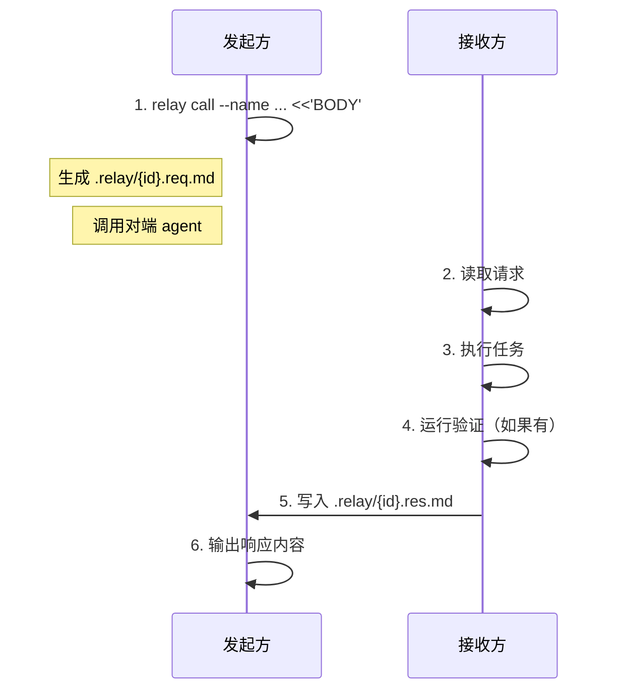

# Relay

**一个让 [Claude Code](https://docs.anthropic.com/en/docs/claude-code) 和 [Codex](https://github.com/openai/codex) 学会互相调用的 skill。**

> *接力棒换手，赛程不断。一个 agent 写下任务，另一个接棒向前。*

[English](README.md) | 中文

Relay 让一个 agent 像调用函数一样调用另一个 agent。写任务、调用对端、读结果。极简协议、自然语言驱动、完全可审计。

```bash
# Claude Code → Codex
relay call --name <slug> [--effort <level>] [--bg] [--body-only] <<'BODY'
task
BODY

# Codex → Claude Code
relay call --name <slug> [--effort <level>] [--body-only] <<'BODY'
task
BODY
```

Relay 由 Relay 自身构建。Claude Code 和 Codex 通过这个 skill 本身来设计协议、讨论取舍、交叉审查、验证结果 — 任务在两个 agent 之间来回传递，而它们传递任务所用的工具正是它们正在创建的 skill。此后的每次迭代也不例外：skill 在使用中打磨自己。

## 目录

- [为什么要用 Relay](#为什么要用-relay)
- [设计哲学](#设计哲学)
- [由 Agent 打造，也为 Agent 打造](#由-agent-打造也为-agent-打造)
- [工作流程](#工作流程)
- [安装](#安装)
- [使用方式](#使用方式)
- [接口](#接口)
- [异步 / 并行](#异步--并行)
- [实用命令](#实用命令)
- [Prism 集成](#prism-集成)
- [安全](#安全)
- [仓库结构](#仓库结构)
- [贡献者](#贡献者)

---

## 为什么要用 Relay

使用单一 agent 时，你只能发挥单一模型的优势。Relay 让你组合两者：

- **任务委派：** 一个 agent 把任务交给另一个执行
- **第二意见：** 交叉审查，弥补同模型盲区
- **跨模型工作流：** 一个实现，一个验证
- **驱动多 agent 审议** — Relay 是 [Prism](https://github.com/chrisliu298/prism) Parallax 层的传输层

### 为什么不直接用 subagent

Subagent 生成的是同一模型的副本。Relay 调用不同模型 — 不同训练数据、不同推理模式、不同盲区。跨模型审查比同模型审查发现更多问题。

---

## 设计哲学

Relay 融合了 Anthropic 与 OpenAI 在 agent 设计上的实践经验，提炼为一个极简协议。

- **协议淡出，任务凸显。** Frontmatter 负责路由；任务正文保持自然语言。[^1]
- **请求自包含，上下文引用优先。** 请求包含任务与响应模板；上下文以文件引用为主，不粘贴大段内容。[^2]
- **验证是一等公民。** 响应在 frontmatter 中携带 `verify: pass | fail | skip`；验证命令和证据放在正文。[^3]
- **引导而非强制。** Relay 推荐正文结构，但不施加死板的 schema。[^4]

这些选择减少格式错误，把协议规则集中在请求文件中，并让调用方无需解析正文即可按验证结果分支。

---

## 由 Agent 打造，也为 Agent 打造

Relay 是 Claude Code 与 Codex 通过 Relay 协议本身协作构建的：双方分别研究各自平台生态，在多轮 relay 往返中讨论取舍，交叉审查彼此改动，并端到端验证最终结果。

这个 skill 本身就鼓励修改。`SKILL.md` 是纯 markdown，团队可以按工作流快速调整：

- 调整正文模式以匹配团队约定
- 增加领域特定的验证命令
- 修改响应 footer 模板以适配不同输出格式
- 如果接入其他 agent，替换对端名称

Relay 刻意保持简洁：没有锁死的 schema，只有一个 agent 与人类都能读懂、可扩展的协议。

---

## 工作流程


```mermaid
sequenceDiagram
    participant I as 发起方
    participant R as 接收方

    I->>I: 1. relay call --name ... <<'BODY'
    Note left of I: 生成 .relay/{id}.req.md
    Note left of I: 调用对端 agent
    R->>R: 2. 读取请求
    R->>R: 3. 执行任务
    R->>R: 4. 运行验证（如果有）
    R->>I: 5. 写入 .relay/{id}.res.md
    I->>I: 6. 输出响应内容
```

`call` 子命令封装了完整的往返流程：生成请求文件、调用对端 agent、将响应内容输出到 stdout。脚本从安装路径自动检测调用方和对端。

---

## 安装

克隆到 agent 的 skills 目录。Relay 为每个 agent 提供不同的 SKILL.md，因此需要通过符号链接安装对应的子目录。

**Claude Code：**

```bash
git clone https://github.com/chrisliu298/relay.git ~/.cache/relay-src
ln -s ~/.cache/relay-src/claude/skills/relay ~/.claude/skills/relay
```

**Codex：**

```bash
git clone https://github.com/chrisliu298/relay.git ~/.cache/relay-src
ln -s ~/.cache/relay-src/codex/skills/relay ~/.codex/skills/relay
```

**重要：** 两个 skill 必须从同一份克隆安装并保持同一版本。请求/响应格式必须匹配；版本不一致会导致任一侧解析失败。

---

## 使用方式

直接自然语言触发委派：

> "让 Codex 审一下 `src/auth.py` 的中间件"

> "把这个发给 Claude，让它也看看"

也可以直接输入 `/relay`。

---

## 接口

### 模型

每个方向指定了特定模型，**请勿**自行替换，否则可能导致调用失败。

| 方向 | 模型参数 | 推理力度 | 说明 |
|---|---|---|---|
| Claude Code → Codex | `--model gpt-5.4` | 动态（`none`–`xhigh`） | Claude 根据任务选择推理力度 |
| Codex → Claude Code | `--model opus` | 不适用 | Claude CLI 无推理力度参数 |

### 调用

一条命令完成完整往返：生成请求、调用对端、输出响应。

**Claude Code → Codex：**

```bash
~/.claude/skills/relay/scripts/relay call --name auth-review --effort medium <<'BODY'
检查 src/auth.py 的安全问题。运行 pytest 验证。
BODY
```

**Codex → Claude Code：**

```bash
~/.codex/skills/relay/scripts/relay call --name auth-review <<'BODY'
检查 src/auth.py 的安全问题。运行 pytest 验证。
BODY
```

`--name` 提供可读的短名称；脚本自动添加时间戳和 PID 前缀（格式：`YYYYMMDD-HHMMSS-PID-{name}`）。`--effort` 控制 Codex 的推理力度（默认 `medium`，调用 Claude 时忽略）。

生成的请求文件 `.relay/20260219-163042-12345-auth-review.req.md`：

```markdown
---
relay: 5
id: 20260219-163042-12345-auth-review
from: claude
to: codex
effort: medium
---

检查 src/auth.py 的安全问题。运行 pytest 验证。

---
Reply: .relay/20260219-163042-12345-auth-review.res.md
Format:
  ---
  relay: 5
  re: 20260219-163042-12345-auth-review
  from: codex
  to: claude
  status: done | error
  verify: pass | fail | skip
  ---
  {your response}
```

### 输出

`call` 子命令将响应文件内容输出到 stdout。响应文件：

```markdown
---
relay: 5
re: 20260219-163042-12345-auth-review
from: codex
to: claude
status: done
verify: pass
---

发现 src/auth.py 中 2 个问题：
1. 第 45 行会话令牌未验证 — 已添加 hmac 校验
2. 第 52 行缺少输入净化 — 已改用参数化查询

修改后 12 个测试全部通过。
```

- **status**：`done` | `error`
- **verify**：`pass` | `fail` | `skip`
- **body**：发现、变更、推理过程 — 自由格式 markdown

使用 `--body-only` 剥离 frontmatter，仅获取 markdown 正文。

请求和响应文件保存在 `.relay/`（自动加入 `.gitignore`）。对端 stderr 记录在请求旁的 `.log` 伴随文件中。

若调用后响应文件不存在，对端失败或超时。请先检查请求、响应路径和 `.log` 伴随文件，再决定是否重试。

---

## 异步 / 并行

默认情况下，`relay call` 会阻塞直到对端完成。当你有独立的工作需要与 relay 调用并行执行时，使用平台原生的并发机制。

### Claude Code

Claude Code 支持 Bash 工具的 `run_in_background: true` 和脚本的 `--bg` 标志：

```bash
# 方式 1：Bash 工具的 run_in_background（agent 原生）
# relay 调用在后台运行，subagent 同时执行其他工作

# 方式 2：--bg 标志（脚本原生）
# 在后台 fork 对端调用，立即返回响应文件路径
RES=$(~/.claude/skills/relay/scripts/relay call --bg --name auth-review --effort medium <<'BODY'
检查 src/auth.py 的安全问题。
BODY
)
# RES 是预期的响应文件路径 — 轮询：[ -f "$RES" ] && cat "$RES"
```

### Codex

Codex 通过原生并行工具调用和子 agent 支持并发，但**不支持** shell 后台化（`&`/`disown`/`nohup` — 子进程在 shell 命令结束后无法继续运行）。

**在 Codex 中不要使用 `--bg`。** 改为启动一个 Codex 子 agent 来执行阻塞的 relay 调用，同时主 agent 继续本地工作：

1. 先并行启动彼此独立的本地任务。
2. 启动一个子 agent，其唯一任务是运行 relay 调用。
3. 主 agent 继续本地工作。
4. 仅在需要结果时等待 relay 子 agent。

---

## 实用命令

```bash
# 显示用法和版本
~/.claude/skills/relay/scripts/relay --help
~/.claude/skills/relay/scripts/relay --version
```

---

## Prism 集成

[Prism](https://github.com/chrisliu298/prism) 是一个多 agent 审议 skill，将同一问题发送给多个独立 agent，每个 agent 从不同分析视角回答同一问题。Relay 为 Prism 的 **Parallax** 层提供传输 — 即跨模型 agent，提供模型多样性。

当 Prism 从 Claude Code 运行时，Parallax 通过 Relay 调用 Codex。当 Prism 从 Codex 运行时，Parallax 通过 Relay 调用 Claude Code。Parallax agent 接收与所有本地 reviewer 完全相同的问题和上下文 — 唯一的区别是分析视角。

```bash
# 安装两个 skill 以获得完整的 Prism 体验
git clone https://github.com/chrisliu298/prism.git ~/.claude/skills/prism
git clone https://github.com/chrisliu298/relay.git ~/.cache/relay-src
ln -s ~/.cache/relay-src/claude/skills/relay ~/.claude/skills/relay
```

如果未安装 Relay，Prism 会退回到同模型对抗性 agent — 功能不受影响，但缺少跨模型视角。

---

## 安全

- `.relay/` 已加入 `.gitignore` — 脚本自动处理
- **Codex** 默认 `--full-auto`（`workspace-write` 沙盒）并附加 `--skip-git-repo-check`（Codex 默认拒绝在非 git 目录中运行）
- **Claude** 非交互模式使用 `--dangerously-skip-permissions` — 仅限可信仓库
- 清理：`rm .relay/*.md .relay/*.log`

---

## 仓库结构

```text
relay/
├── scripts/relay                # 规范脚本（唯一真实来源）
├── claude/skills/relay/
│   ├── SKILL.md                 # Claude 专用 skill（调用 Codex）
│   ├── references/
│   │   └── prompting-codex.md   # 如何有效提示 Codex
│   └── scripts/relay            # → ../../../../scripts/relay（符号链接）
└── codex/skills/relay/
    ├── SKILL.md                 # Codex 专用 skill（调用 Claude）
    ├── references/
    │   └── prompting-claude.md  # 如何有效提示 Claude
    └── scripts/relay            # → ../../../../scripts/relay（符号链接）
```

Bash 脚本仅存在于 `scripts/relay`。两个平台目录通过符号链接指向它，消除重复的同时保留各自独立的 SKILL.md 文件，以适配各 agent 不同的触发文本、异步模式和提示指南。

---

## 贡献者

- [@chrisliu298](https://github.com/chrisliu298)
- **Claude Code** — 协议设计
- **Codex** — 执行契约与 CLI 集成

[^1]: Anthropic — [Building effective agents](https://www.anthropic.com/research/building-effective-agents)、[Writing tools for agents](https://www.anthropic.com/engineering/writing-tools-for-agents)；OpenAI — [A practical guide to building agents](https://openai.com/business/guides-and-resources/a-practical-guide-to-building-ai-agents/)、[Unrolling the Codex agent loop](https://openai.com/index/unrolling-the-codex-agent-loop/)
[^2]: Anthropic — [Effective context engineering](https://www.anthropic.com/engineering/effective-context-engineering-for-ai-agents)；OpenAI — [Conversation state](https://developers.openai.com/api/docs/guides/conversation-state)、[Compaction](https://developers.openai.com/api/docs/guides/compaction)
[^3]: Anthropic — [Demystifying evals for AI agents](https://www.anthropic.com/engineering/demystifying-evals-for-ai-agents)；OpenAI — [Agent evals](https://developers.openai.com/api/docs/guides/agent-evals)
[^4]: Anthropic — [Building effective agents](https://www.anthropic.com/research/building-effective-agents)、[Writing tools for agents](https://www.anthropic.com/engineering/writing-tools-for-agents)；OpenAI — [Function calling](https://developers.openai.com/api/docs/guides/function-calling)
